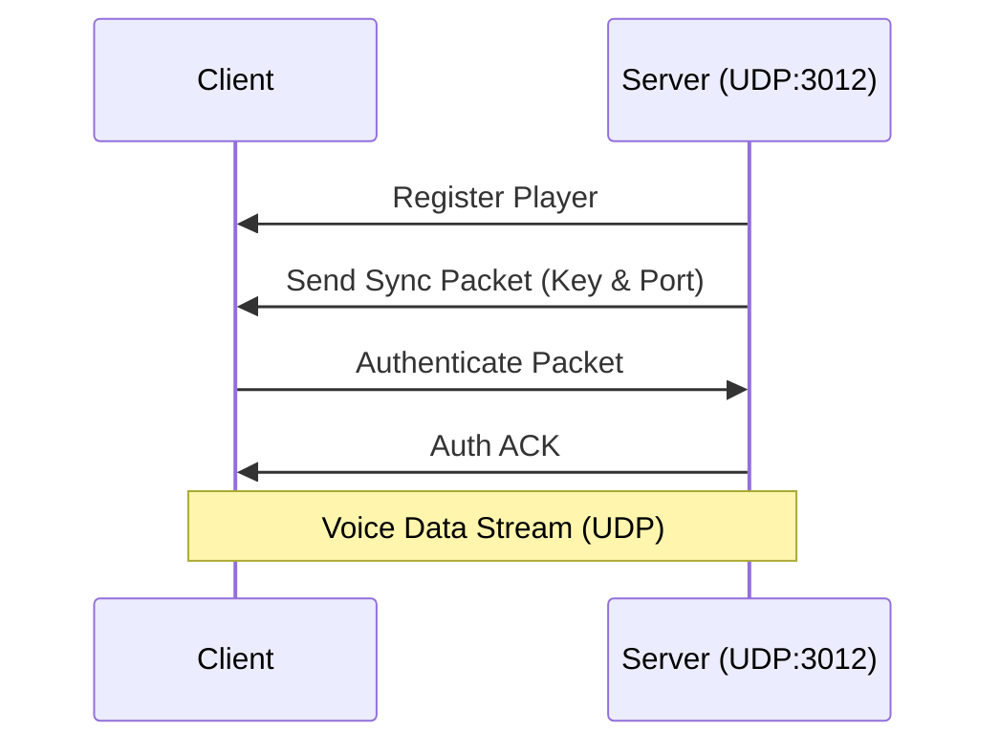

# KrackedVoice 🎙️

### Premium Proximity Voice Chat for Hytale

> **Developed by MoonWiRaja @ KRACKEDDEVS**

  

---

## 📖 Overview

**KrackedVoice** is a cutting-edge proximity voice chat solution designed specifically for Hytale servers. Leveraging UDP networking and AES-256 encryption, it provides low-latency, secure, and immersive voice communication for players.

### ✨ Key Features

- **📍 Proximity-Based Audio**: Hear players louder as you get closer.
- **🚀 UDP Networking**: Extremely low latency for real-time conversation.
- **🔒 AES-256 Encryption**: Military-grade security for your voice data.
- **🔌 Plug & Play**: Automatic player registration and seamless connection.
- **🛠️ Fully Configurable**: Adjust distance falloff, ports, and more.

---

## ⚠️ Important Compatibility Notice

**For Hytale 2026 Servers:**

Due to Hytale's security model, client-side scripts from server mods are **not** automatically loaded. Therefore, this mod consists of two parts:

1.  **Server Plugin (`.jar`)**: Runs on your Hytale server.
2.  **Client Mod**: Must be installed by every player to enable voice chat.

---

## 🛠️ Installation Guide

### For Server Admins

1.  **Download Build**: Get the latest `KrackedVoice-1.0.0.jar` from the [Releases](#) page.
2.  **Install**: Place the `.jar` file into your server's `plugins/` directory.
3.  **Network Setup**: Ensure UDP port **3012** (default) is open on your firewall.
4.  **Restart**: Restart your server to load the plugin.

#### Configuration (`plugins/KrackedVoice/config.json`)

```json
{
  "enabled": true,
  "voiceHost": "0.0.0.0",
  "voicePort": 3012,
  "proximityEnabled": true,
  "encryptionEnabled": false,
  "maxDistance": 20.0,
  "falloffType": "linear",
  "bitrate": 64000,
  "pushToTalkKey": "V",
  "muteToggleKey": "M"
}
```

### For Players

1.  **Download Mod**: Get the KrackedVoice Client Mod.
2.  **Install**: Drop the mod file into your Hytale `mods/` folder.
3.  **Play**: Launch Hytale and join a supported server. The mod connects automatically!

---

## 🎮 Commands

| Command | Description |
| :--- | :--- |
| `/voice` | Opens the voice chat settings menu (Client-side). |
| `/mute` | Toggles your microphone mute status. |
| `/voicedebug` | Displays current connection status and debug info. |

---

## 🏗️ Architecture

KrackedVoice uses a robust client-server architecture to ensure reliability:



---

## 🔧 Troubleshooting

### Common Issues

**🔴 "Not connected to UDP Bridge!"**
*   **Cause**: Client mod missing or blocked.
*   **Fix**: Verify mod installation and check firewall settings.

**🟡 "Server Port: 3012" visible but no voice**
*   **Cause**: UDP connection failure.
*   **Fix**: Ensure the server's UDP port 3012 is properly port-forwarded/allowed.

---

## 💻 Building from Source

To build the project locally:

```bash
git clone https://github.com/KrackedDevs/kracked-voice.git
cd kracked-voice
gradlew clean build
```

Artifact will be located at: `build/libs/KrackedVoice-1.0.0.jar`

---

## 📄 License

This project is licensed under the **MIT License**.

Copyright © 2026 **MoonWiRaja KRACKEDDEVS**

---

## 📬 Support

*   **GitHub**: [KrackedDevs/kracked-voice](https://github.com/MoonWiRaja/hytale-voice)
*   **Email**: _Coming Soon
*   **Discord**: [_Krackeddevs Dc_](https://discord.gg/5DPRhGpXxP)
*   **Web**: [Krackeddevs Web](https://krackeddevs.com)
